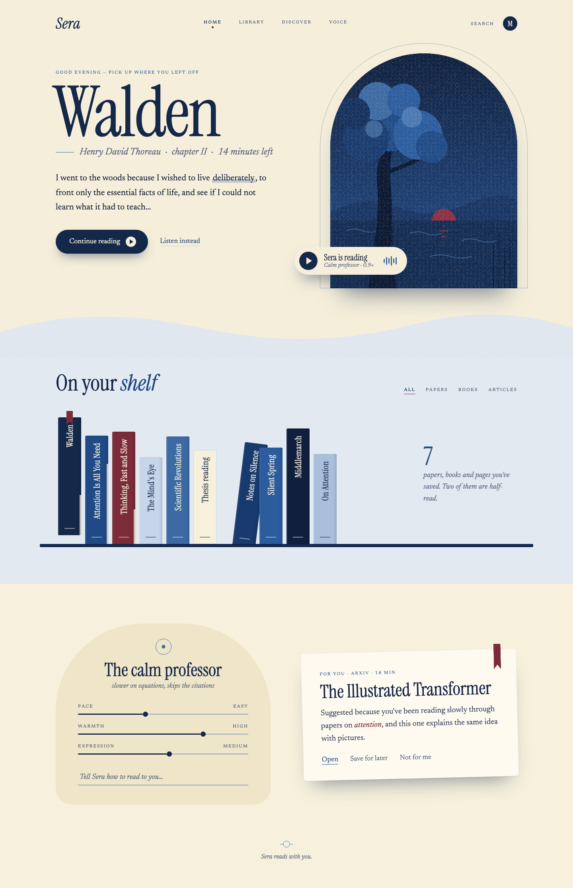
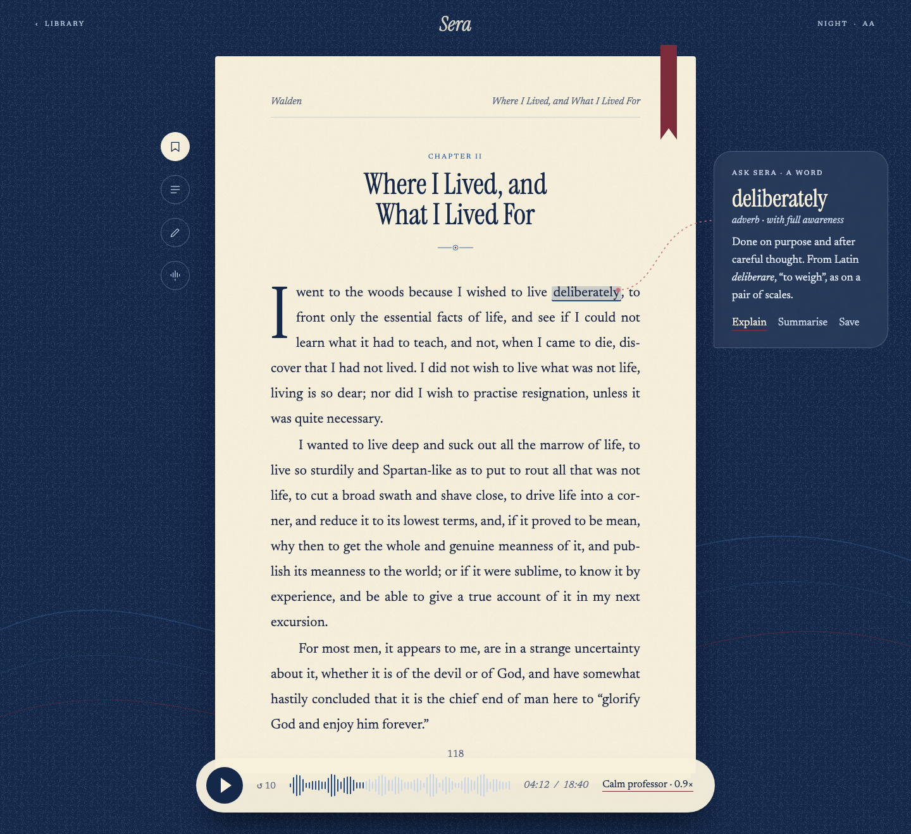

# Sera

**A reading companion that reads with you.** Upload a PDF and Sera reads it aloud in a natural voice, highlighting each word as it goes. Tap any word to start from there. Tell Sera how you want to be read to, and it adapts.

> 🚧 **Work in progress.** Sera is under active development. I'm currently in **Phase 3: voice intelligence**. This page describes where it's headed and what exists so far.

  

  

Desktop UI design.

## Why I'm building it

Most of what's on our screens is built to be scrolled, not read. Long-form reading, like papers, books and essays, is hard to sustain when everything around it is competing for a few seconds of attention.

I wanted a reader that makes deep reading feel as easy as the things it competes with: something you can listen to, follow along with, and steer. It's also meant for people who find dense text tiring, such as students, researchers and anyone who reads with difficulty.

The design borrows from bookbinding and print rather than typical app dashboards. It uses paper tones, serif type and a bookshelf, so the app feels like a place to read.

## The idea

- **Listen and follow.** A word-by-word highlight tracks the voice across the page.
- **Read from anywhere.** Click a word and playback picks up from that spot.
- **A voice you direct.** Describe how you want to be read to ("slower on equations, skip the citations") instead of hunting through settings.
- **Ask as you read.** Select a word or passage to look it up or get a short explanation.
- **Read next.** Suggestions based on how you actually read.

## Where it stands

| Phase | Focus | Status |
|---|---|---|
| 1 | Foundation: API, database, frontend shell, automated tests and CI | ✅ Done |
| 2 | PDF reading: word-level positions, scanned-PDF support (OCR), page viewer, accounts and library | ✅ Done |
| 3 | **Voice intelligence**: natural, controllable reading voice synced to the page | 🔨 **In progress** |
| 4+ | In-reader assistance, personalised recommendations, public launch | Planned |

## Built with

Python and FastAPI on the backend, React and TypeScript on the frontend, PostgreSQL for data, and Docker for local development. Automated tests run on every change.

## How it's built

The source is private while the project is in active development, but the way it is built is not.
**[ENGINEERING.md](ENGINEERING.md)** covers the working method: expectations written before the
code runs, claims measured rather than asserted, tests checked by deliberately breaking the code,
and every failure kept on the record. Two unedited entries from the build journal are included.

I'm happy to walk through the code in person.

## Contact

**Mohona Yesmin** · [github.com/myesmin](https://github.com/myesmin)

---

© 2026 Mohona Yesmin. All rights reserved.
